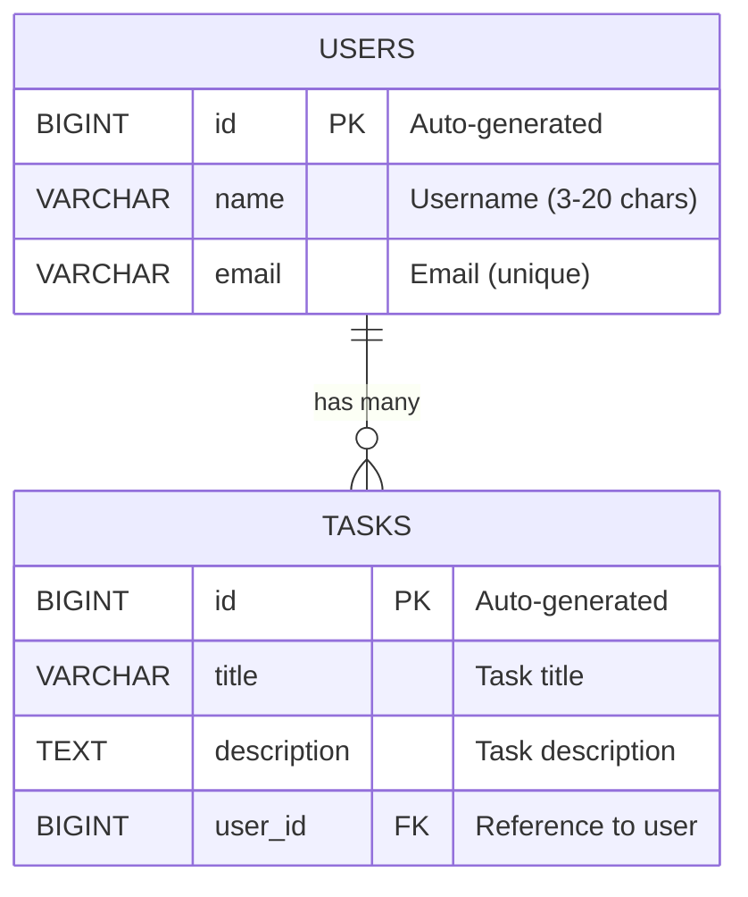

# 📝 Todo Application

A modern, RESTful Todo application built with Spring Boot that allows users to manage their tasks efficiently. This application provides a complete CRUD API for both users and tasks with proper validation, error handling, and clean architecture.


## 🚀 Features

- ✅ **User Management**: Create, read, update, and delete users
- ✅ **Task Management**: Full CRUD operations for tasks
- ✅ **Data Validation**: Comprehensive input validation with custom error messages
- ✅ **Exception Handling**: Global exception handling with meaningful error responses
- ✅ **Clean Architecture**: Well-structured codebase with separation of concerns
- ✅ **API Documentation**: RESTful API design with consistent response format
- ✅ **Data Mapping**: Automatic entity-DTO mapping using MapStruct

## 🏗️ Architecture

```
src/main/java/org/mytodoapp/todo/
├── 📁 shared/
│   ├── 📁 dto/           # Shared DTOs (ApiResponse)
│   ├── 📁 exception/     # Custom exceptions & global handler
│   └── 📁 util/          # Utility classes (ResponseBuilder)
├── 📁 user/
│   ├── 📁 controller/    # REST controllers
│   ├── 📁 dto/           # Data Transfer Objects
│   ├── 📁 entity/        # JPA entities
│   ├── 📁 mapper/        # MapStruct mappers
│   ├── 📁 repo/          # JPA repositories
│   └── 📁 service/       # Business logic
└── 📁 task/
    ├── 📁 controller/    # REST controllers
    ├── 📁 dto/           # Data Transfer Objects
    ├── 📁 entity/        # JPA entities
    ├── 📁 mapper/        # MapStruct mappers
    ├── 📁 repo/          # JPA repositories
    └── 📁 service/       # Business logic
```

## 🛠️ Tech Stack

- **Framework**: Spring Boot 3.5.5
- **Language**: Java 21
- **Database**: JPA/Hibernate compatible databases
- **Mapping**: MapStruct for entity-DTO mapping
- **Validation**: Bean Validation (JSR 303)
- **Build Tool**: Maven
- **Architecture**: Layered Architecture (Controller → Service → Repository)

## 📊 Database Schema



## 🔧 Getting Started

### Prerequisites

- Java 21 or higher
- Maven 3.5.5+
- Your preferred database (H2, MySQL, PostgreSQL, etc.)

### Installation

1. **Clone the repository**
   ```bash
   git clone https://github.com/yourusername/todo-app.git
   cd todo-app
   ```

2. **Configure database connection**
   ```properties
   # application.properties
   spring.datasource.url=jdbc:your-database-url
   spring.datasource.username=your-username
   spring.datasource.password=your-password
   spring.jpa.hibernate.ddl-auto=update
   ```

3. **Build the project**
   ```bash
   mvn clean compile
   ```

4. **Run the application**
   ```bash
   mvn spring-boot:run
   ```

The application will start on `http://localhost:8080`

## 📡 API Documentation

### 👤 User Endpoints

| Method | Endpoint | Description |
|--------|----------|-------------|
| `POST` | `/api/users` | Create a new user |
| `GET` | `/api/users` | Get all users |
| `GET` | `/api/users/{userId}` | Get user by ID |
| `PUT` | `/api/users/{userId}` | Update user |
| `DELETE` | `/api/users/{userId}` | Delete user |

### ✅ Task Endpoints

| Method | Endpoint | Description |
|--------|----------|-------------|
| `POST` | `/api/users/{userId}/tasks` | Create a task for user |
| `GET` | `/api/users/{userId}/tasks` | Get all tasks for user |
| `GET` | `/api/users/{userId}/tasks/{taskId}` | Get specific task |
| `PUT` | `/api/users/{userId}/tasks/{taskId}` | Update task |
| `DELETE` | `/api/users/{userId}/tasks/{taskId}` | Delete task |

### 📝 Request/Response Examples

#### Create User
```http
POST /api/users
Content-Type: application/json

{
    "username": "johndoe",
    "email": "john.doe@example.com"
}
```

#### Success Response
```json
{
    "status": 201,
    "message": "Created",
    "data": {
        "id": 1,
        "username": "johndoe",
        "email": "john.doe@example.com"
    },
    "errors": null,
    "timestamp": "16-09-2025 10:30:45"
}
```

#### Create Task
```http
POST /api/users/1/tasks
Content-Type: application/json

{
    "title": "Complete project documentation",
    "description": "Write comprehensive README and API documentation"
}
```

#### Error Response
```json
{
    "status": 400,
    "message": "Validation Failed",
    "data": null,
    "errors": [
        "title: Task title is required",
        "description: Task description is required"
    ],
    "timestamp": "16-09-2025 10:35:22"
}
```

## 🎯 Key Features Explained

### ✨ Validation System
- **User Validation**: Username (3-20 chars, alphanumeric + underscore), valid email format
- **Task Validation**: Required title and description fields
- **Custom Error Messages**: Meaningful validation messages for better user experience

### 🛡️ Exception Handling
- **Global Exception Handler**: Centralized error handling across the application
- **Custom Exceptions**: `RecordNotFoundException`, `DuplicateResourceException`
- **Consistent Response Format**: All responses follow the same `ApiResponse` structure

### 🔄 Data Mapping
- **MapStruct Integration**: Automatic mapping between entities and DTOs
- **Clean Separation**: Clear distinction between internal entities and external DTOs
- **Type Safety**: Compile-time mapping validation

## 🤝 Contribution

Contributions, issues, and feature requests are welcome!
